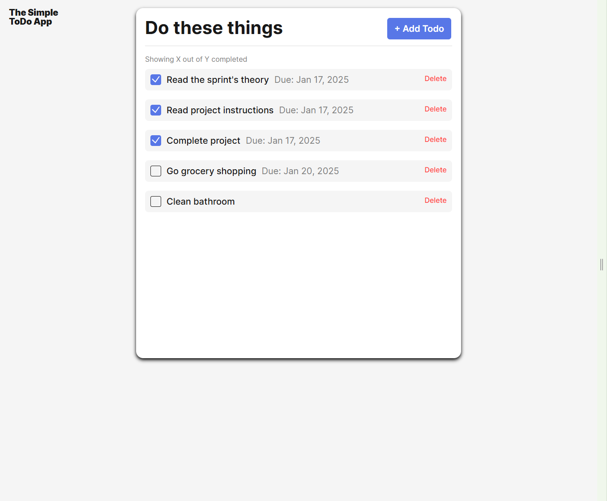
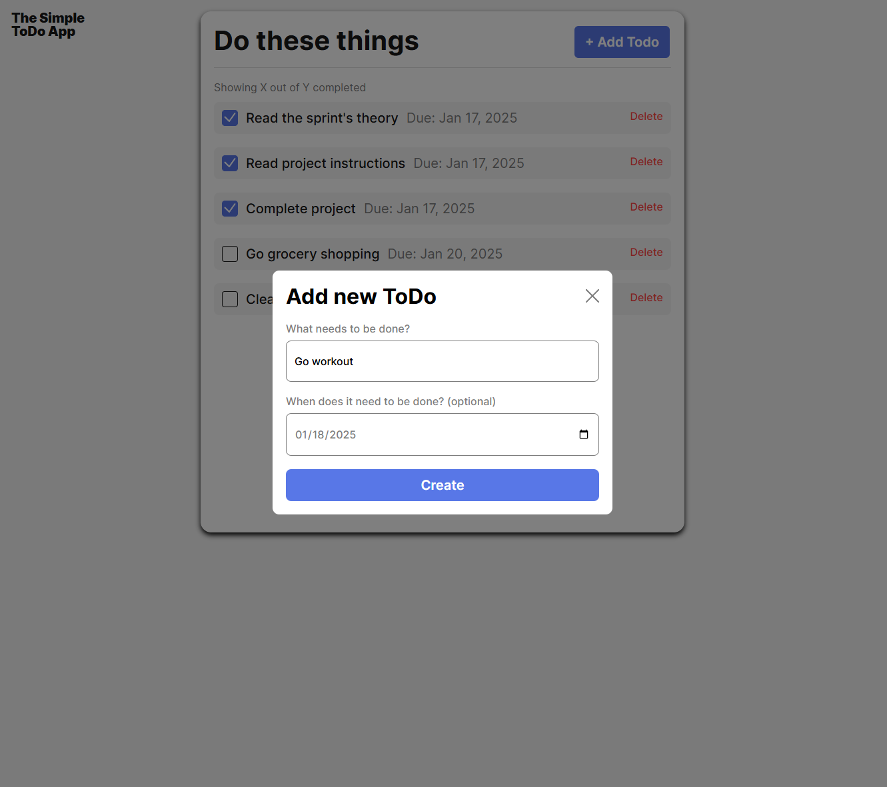

# Julian's Efficient Todo App

This quick and effective app offers users the ability to write down a list of tasks that
need to be done. Users can enter an optional due date for maximum time management.

## Functionality

This project uses JavaScript modules to import classes into a main script.
The Todo class handles displaying each task and implements functionality for the buttons it requires.
Users can check off tasks that they've completed and delete them when done.
The FormValidation class ensures that users are entering the correct information when submitting a new
task. There are clear error messages for users to follow in case of any difficulty.

## Technology

- HTML
- CSS
- JavaScript (ES6 modules)
- uuid (for generating unique IDs for each Todo task)

## Deployment

This project is deployed on GitHub Pages:

- ADD LINK HERE
